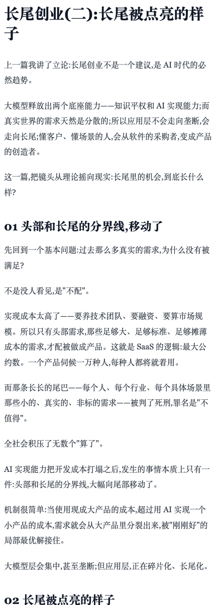
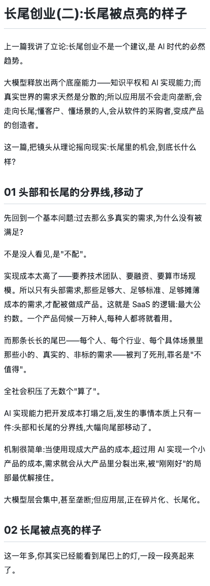
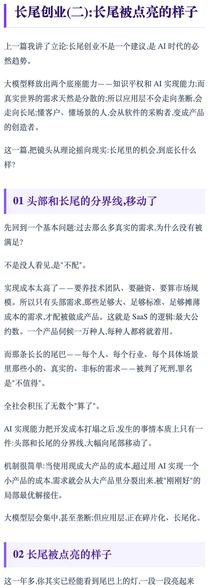

# Uploadweixin 微信公众号排版 Skill

把 Markdown 文章排成可以直接粘贴到微信公众号编辑器的内联 HTML。

## 它能做什么

- 支持 12 套中文文章主题，覆盖长文、技术教程、产品更新、访谈对话等场景。
- 生成 `article.html` 和 `preview.html`，预览页带一键富文本复制按钮。
- 自动校验公众号编辑器不友好的标签和样式，例如 `<style>`、`<script>`、事件属性、复杂 CSS 布局。
- 支持 macOS 富文本剪贴板脚本，解决浏览器或输入法剪贴板只保留纯文本的问题。
- 支持自定义 Upload / 记忆同步尾注，也可以关闭尾注。

## 长尾创业样张

以下截图来自《长尾创业》文章的真实渲染结果。

| Editorial | GitHub Dev | Timeline |
| --- | --- | --- |
|  |  |  |

## 快速开始

```bash
python3 scripts/render_wechat_article.py \
  --input /path/to/article.md \
  --theme upload-clean \
  --output /tmp/wechat-output \
  --footer enabled

python3 scripts/validate_wechat_html.py /tmp/wechat-output/article.html

python3 scripts/make_preview.py \
  --input /tmp/wechat-output/article.html \
  --output /tmp/wechat-output/preview.html
```

打开 `/tmp/wechat-output/preview.html`，点击 `复制到公众号编辑器`，再粘贴到微信公众号编辑器。

## 常见问题

**粘贴后格式丢了怎么办？**  
优先使用 `preview.html` 里的复制按钮；如果仍然只粘贴出纯文本，在同一台 Mac 上运行 `scripts/copy_wechat_clipboard_macos.swift`。

**为什么不用复杂 CSS？**  
微信公众号编辑器会过滤很多布局写法。这个 Skill 主动避免复杂 CSS，以换取更稳定的粘贴结果。

**普通用户需要懂代码吗？**  
不需要理解脚本内部逻辑。准备好 Markdown 后，按快速开始的三条命令执行即可。
